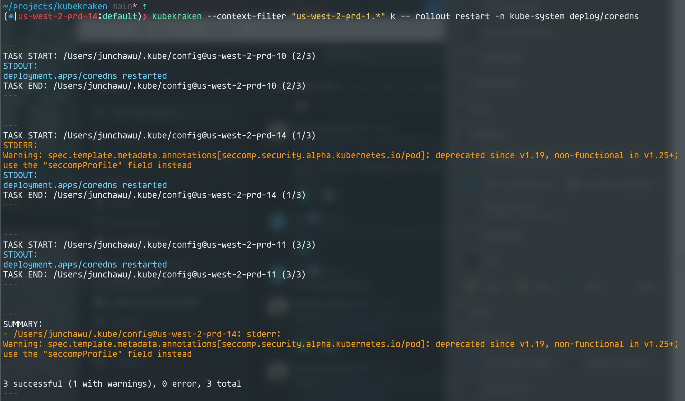

# KubeKraken

<div align="center">
  
</div>

[](https://goreportcard.com/report/github.com/junchaw/kubekraken)
[](https://github.com/junchaw/kubekraken/blob/main/LICENSE)
[](https://hub.docker.com/r/junchaw/kubekraken/)
[](https://github.com/junchaw/kubekraken/actions/workflows/release.yml)

Kubekraken is a powerful CLI tool that unleashes multiple kubectl commands in parallel—tame your clusters with ease.

```shell
kubekraken --context-filter "us-west-2-prd-.*" k -- rollout restart -n kube-system deploy/coredns
```

<div align="center">
  
</div>

## Usage

```shell
kubekraken -h

# Run kubectl commands in parallel, by default will use KUBECONFIG environment variable, and all context in the kubeconfig file
kubekraken kubectl version

# We have a alias for kubectl, and you need to put "--" before the kubectl command if the args contains any flags,
# so that kubekraken can distinguish the kubectl args from the kubekraken args.
kubekraken k -- get pods -n kube-system -l k8s-app=kube-proxy

# You can use --kubeconfig-files to specify the kubeconfig files to use, it could be files or directories,
# if there is any directory, kubekraken will find all the kubeconfig files in the directory,
# --kubeconfig-filter can be used with directory to filter the kubeconfig files, but it will not filter files specified in --kubeconfig-files.
kubekraken --kubeconfig-files ~/.kube --kubeconfig-filter ".*.yaml$" -- rollout restart -n kube-system deployment/coredns

# You can use --context-filter to filter the contexts to run the commands on, it will filter the contexts in the kubeconfig files,
# or use --use-current-context to use the current context in the kubeconfig file, in this case --context-filter will be ignored.
kubekraken --kubeconfig-files ./kubeconfigs --context-filter "(us-west-1|us-west-2)" -- get nodes us-west-1-node-abc
kubekraken --kubeconfig-files ./kubeconfigs --use-current-context -- get nodes us-west-2-node-abc

# You can use --output-file to save the output to a file, it will save the output to the file,
# or use --output-dir to save the output to a directory, each context will have separate output files.
kubekraken --kubeconfig-files ./kubeconfigs --output-file ./tmp/output.txt -- get nodes us-west-2-node-abc
kubekraken --kubeconfig-files ./kubeconfigs --output-dir ./tmp/output -- get nodes us-west-2-node-abc
```

Other flags:

```shell
Available Commands:
  completion    Generate the autocompletion script for the specified shell
  help          Help about any command
  kubectl       Run kubectl commands
  list-contexts List available Kubernetes contexts

Flags:
      --context-filter string      Regex filter for context names (e.g. prd-.*), see --use-current-context if you want to use the default context
  -h, --help                       help for kraken
      --kubeconfig-files strings   Kubeconfig files, item could be directory or file, in case of directory, all files in the directory will be used, see --kubeconfig-filter (default [/Users/junchawu/.kube/config])
      --kubeconfig-filter string   Regex filter for kubeconfig files, used with kubeconfig from directory, will not filter items specified in --kubeconfig-files (e.g. prd-.*\.yaml)
      --no-stdout                  Do not print kubectl stdout (stderr will still be printed)
      --output-dir string          Output directory for the results, kubekraken will save stdout/stderr/error to files under this directory
      --output-file string         Output file for the results, kubekraken will save stdout/stderr/error to this file
      --output-format string       Output format for the results (text, json) (default "text")
      --use-current-context        Only use the current context from the kubeconfig file, if set, --kubeconfig-filter will be ignored
      --workers int                Number of workers to run concurrently (default 99)
```

Run with docker:

```shell
docker run junchaw/kubekraken -h
```

Or run from source:

```shell
go run .
```
